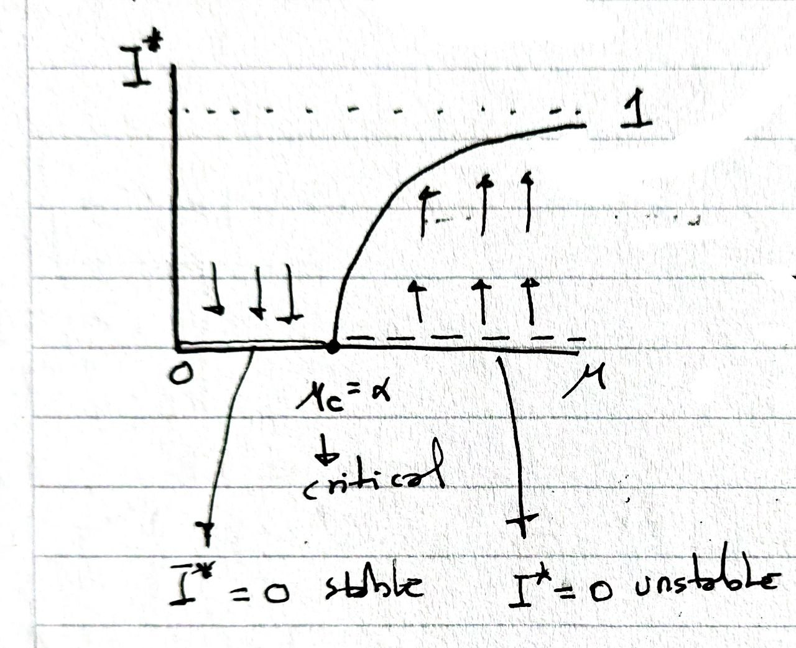

```{r xaringan-scribble, echo=FALSE}
xaringanExtra::use_scribble()
#xaringanExtra::use_webcam()
```

## Definimos el modelo

* Suceptibles $\fbox{ S }$

* Infectados $\fbox{ I }$

* Los infectados se recuperan y pasan a ser suceptibles con una tasa $\alpha$ 

  $I \xrightarrow{\alpha} S$


* Los los suceptibles que entran en contacto con infectados se infectan con una tasa $\mu$ 

  $S+I \xrightarrow{\mu} 2I$

* Asumimos que no hay nacimientos ni muertes por lo que la población total es

  $N= S + I$

---

## Definimos el modelo

* Luego podemos definir las ecuaciones 

  $\frac{dI}{dt}= -\alpha I + \mu S I$

  $\frac{dS}{dt}=  \alpha I - \mu S I$

--
* para simplificar como $N= S + I$ podemos normalizar 

  $I= \frac{I}{N} ,\quad S= \frac{S}{N} \implies S+I = 1$

--
* Podemos reducir todo a 1 ecuación

   $\frac{dI}{dt}  =  - \alpha I - \mu I (I-1)$
   
   $\hspace{1cm}=   \mu I \left( 1 - \frac{\alpha}{\mu} -  I \right)$ 
   
   
---

## Puntos de equilibrio estables o inestables

1. $f_u(I^*) = \mu I \left( 1 - \frac{\alpha}{\mu} -  I \right) = 0$

--

1. Tenemos  $I^*_0 =0 , \qquad I^*_1 =1 - \frac{\alpha}{\mu}$

--

1. $\lambda_u(I) =  \frac{df_u}{dI} = \mu \left[ (1 - \frac{\alpha}{\mu}) - 2I \right]$

--

1. $\lambda_u(0) =  \mu  (1 - \frac{\alpha}{\mu}) = \mu - \alpha$

1. Por lo tanto es estable $\iff \mu - \alpha < 0 \implies \mu < \alpha$

1. Si esto sucede la propagación de la infección no es posible!

2. Para el otro punto de equilibrio sucede lo contrario 
   $\lambda_u(1 - \frac{\alpha}{\mu}) =  \mu  (  \frac{\alpha}{\mu} - 1) = \alpha - \mu$

---
## Diagrama de bifurcaciones
.pull-left[

]
.pull-right[
* Podemos definir $R_0 = \frac{\mu}{\alpha}$

* Si $R_0< 1$ no hay propagación de la epidemia

* El efecto de la vacunacion es disminuir la cantidad de $S$ 
]


---
## SIS estocástico 

* $S+I = N > 0$

--

Asumiendo un intervalo de tiempo pequeño $h$ en el transcurso $t$ a $t+h$ 

1. $P(I \to I+1) = (\mu S I )h = Bi(t)h$ 

1. $P(I \to I-1) = (\alpha I)h = Di(t)h$

1. $P(S \to S+1) = (\alpha I)h = Bs(t)h$

1. $P(S \to S-1) = (\mu S I )h = Ds(t)h$ 

Luego

1. $R = Bi+Di+Bs+Ds$
---

## Simular el SIS estocástico 

* El algoritmo para simular es:

    1. Calcular $Bi,Di,Bs,Ds$ y $R$

    1. Tomar dos numeros al azar $Y_1$, $Y_2$

    2. Si $Y_1 \leq Bi/R$ el próximo evento es $I+1$.

    2. Si no, pero  $Y_1 \leq (Bi+Di)/R$ el próximo evento es $I-1$.

    2. Si no, pero  $Y_1 \leq (Bi+Di+Bs)/R$ el próximo evento es $S+1$.

    2. Si no, el próximo evento es $S-1$.

    3. Calcular el tiempo inter-eventos $s = - log_e(Y_2) / R(N)$

    4. Acumular $t = t + s$

    5. Volver a 1. 
    
---

## Recordemos que 

 $I \xrightarrow{\alpha} S$

$S+I \xrightarrow{\mu} 2I$

---

## Referencias

1. Renshaw, E. (1993). Modelling biological populations in space and time. Cambridge University Press. [Capitulo 10]

2. <http://epirecip.es/epicookbook/chapters/sir/julia>
