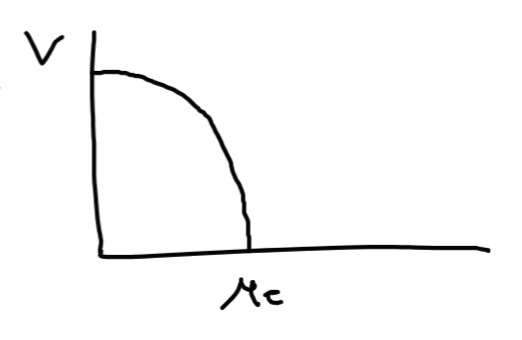

```{r xaringan-scribble, echo=FALSE}
xaringanExtra::use_scribble()
#xaringanExtra::use_webcam()
```
## Del modelo Fuegos en el bosque tomamos el bosque

* Tenemos el Bosque $V$ que crece a una tasa $\lambda_V$ 

  $V + Ø \xrightarrow{\lambda} V + V$

* y se muere con tasa $\delta$

  $V \xrightarrow{\delta} Ø$

* Suponemos area $N = X*Y$  (finita) 

* Pero los sitios de $N$ solamente interaccionan con los sitios vecinos
  
* Definimos vecindad como los 4 sitios mas cercanos al actual

---
## Modelo bosque espacial

* Si suponemos que todos los sitios estan en contacto, llamado modelo de campo medio

* Tenemos un crecimiento logístico igual al modelo SIS

  $\frac{dV}{dt} = -\delta_V  V + \lambda_V V (N-V)$

* Tenemos  $V^*_0 =0 , \qquad V^*_1 =N - \frac{\delta}{\lambda}$

* Definimos $\mu = \frac{\delta}{\lambda}$ y tenemos un punto crítico




---
## Modelo bosque espacial

* ¿Será el punto crítico del modelo de campo medio igual al del modelo espacial?

--

* Estos eran los eventos del modelo no espacial 

1. $V + Ø \xrightarrow{\lambda} V + V$

    $P(V \to V+1, Ø \to Ø-1 ) = (\lambda V Ø )h = B\textrm{v}(t)h$ 

1. $V \xrightarrow{\delta} Ø$

    $P(V \to V-1, Ø \to Ø+1) = (\delta V)h = D\textrm{v}(t)h$

* Definíamos una tasa total de eventos como $R=B\textrm{v}(t)+D\textrm{v}(t)$

---
## Modelo bosque espacial

* La tasa total de eventos por sitio es $\lambda+\delta$

--

* Entonces el algoritmo es 
 
  1. Tomamos un sitio al azar dentro de $N$
  
  2. Si está vacio no hacemos nada, volvemos a 1.
  
  3. Tomamos un numero al azar  $Y$ 
  
  4. Si $Y \leq \frac{\lambda}{\lambda+\delta}$ 
     
     1. tomamos al azar un sitio vecino

     5. Si está vacío se convierte en bosque, sino no hacemos nada
     
  4. Sino (con prob. $\frac{\delta}{\lambda+\delta}$) muere el bosque del sitio
  
  5. Volvemos a 1.
  
  5. una vez que completamos $(\lambda+\delta) N$ evaluaciones termina un paso de tiempo.


---

## Referencias

1. Durrett, R., and Levin, S. A. (1994). Stochastic spatial models: a user’s guide to ecological aplications. Philosophical transactions of the Royal Society of London. Series B 343, 329–350.

2. Berec, L. (2002). Techniques of spatially explicit individual-based models: construction, simulation, and mean-field analysis. Ecological Modelling 150, 55–81. doi:10.1016/S0304-3800(01)00463-X.
 
