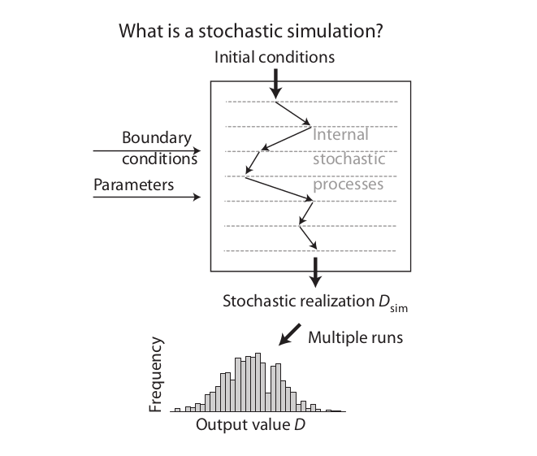
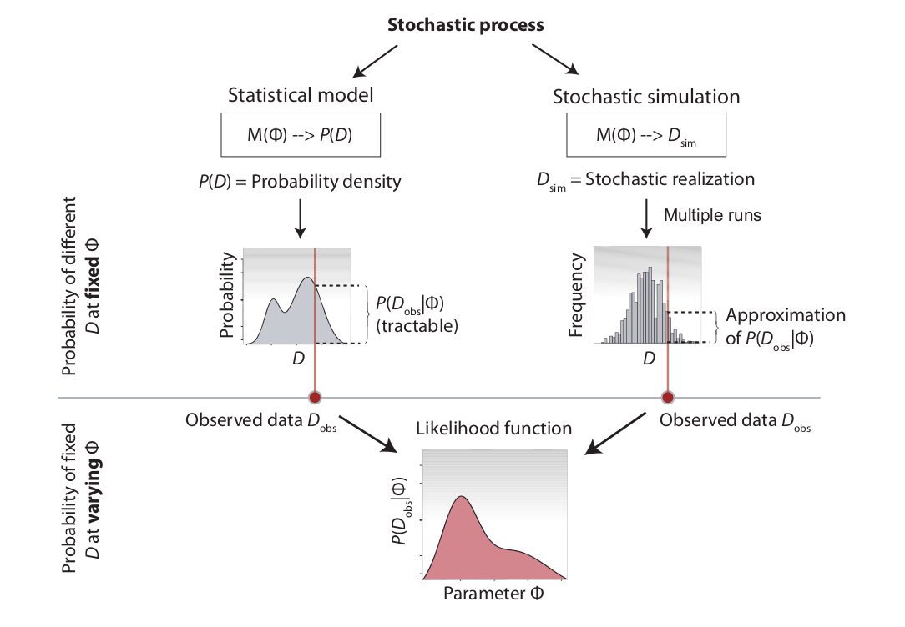
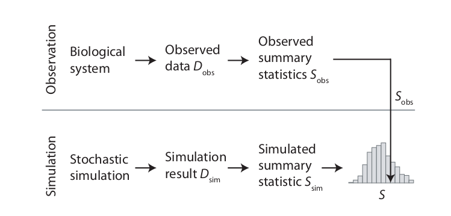
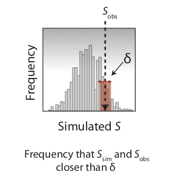

```{r xaringan-scribble, echo=FALSE}
xaringanExtra::use_scribble()
#xaringanExtra::use_webcam()
```

## Metodología para el desarrollo de modelos

1. Hipótesis, objetivos, marco teórico

--

2. Modelo/s conceptual, causal, gráfico.

--

3. Desarrollo del modelo/s con 1. y 2.

--

4. Validación teniendo en cuenta 1. 2.

--

5. Comparación con datos 

---
## ABC - Approximate Bayesian computation

* Para un modelo $M(\phi )$ dado que tenemos observaciones $D_{obs}$

--

* Debe ser posible calcular $p(D_{obs} |\phi)$, la probabilidad de obtener los datos observados, para cada posible parametrización del modelo $\phi$.
--

* Usaremos el término likelihood (verosimilitud) como sinónimo de $p(D_{obs} |\phi)$.

--

* Sobre la base de esta probabilidad, se pueden derivar métodos estadísticos para la estimación de parámetros, la selección de modelos y el análisis de incertidumbre [1].


---
## ABC - Simulaciones estocásticas 

.center[

]

---
## ABC - Procesos estocásticos 

.center[

]

---
## ABC - Comparacion de modelos y datos

.center[

]

---
## ABC - Metodo del rechazo para obtener el likelihood

.center[

]

---
## ABC - Seleccion de modelos 

* Se puede realizar una selección de modelos de forma jerárquica [2]

  1. Se muestrea un modelo de la distribución anterior para los modelos
--

  2. Dado el modelo muestreado, los parámetros del modelo se muestrean de las distribuciones previas 

--
  3. Se realiza una simulación como en el modelo simple ABC. 

--
  4. Las frecuencias relativas de aceptación de los diferentes modelos ahora se aproximan 
     a la distribución posterior de estos modelos.


---
## ABC en la practica


* ABC con el modelo de bosque2D 

--

* Elegir un estadístico de comparación

--

* Elegir una distancia

--

* Elegir una distribución a priori para los parámetros

--

* Generar datos con el modelo

--

* Verificar que el algoritmo ajusta a los valores usados como datos

--

* Ajustar con datos reales


---
## Referencias

1. Hartig, F., Calabrese, J. M., Reineking, B., Wiegand, T., and Huth, A. (2011). Statistical inference for stochastic simulation models – theory and application. Ecology Letters 14, 816–827. doi:10.1111/j.1461-0248.2011.01640.x.

1. Sunnåker, M., Busetto, A. G., Numminen, E., Corander, J., Foll, M., and Dessimoz, C. (2013). Approximate Bayesian Computation. PLOS Computational Biology 9, e1002803. doi:10.1371/journal.pcbi.1002803.

1. McElreath, R. (2020). Statistical rethinking: a Bayesian course with examples in R and Stan. 2nd ed. Boca Raton: Taylor and Francis, CRC Press. [Lectures 2022](https://www.youtube.com/playlist?list=PLDcUM9US4XdMROZ57-OIRtIK0aOynbgZN)


