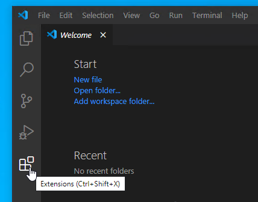
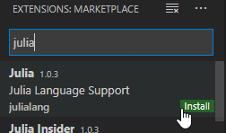

# Curso Ecología Matemática 2022 - UBA

## Modelando con Julia

### 1. Instalacion de Julia:

* La instalacion del lenguaje de programacion Julia es muy sencilla tanto en windows como un linux aqui les dejo el link

  https://julialang.org/downloads/platform/

* En linux hay distintas opciones pero despuede de descargar y descomprimir el archivo como explica en la página se puede crear un `symbolic link` 
  al directorio donde se instaló julia en mi caso `~/julia-1.7.1/bin/julia` a un directorio que ya este en el PATH `~/bin/julia`

```
>ln -s ~/julia-1.7.1/bin/julia ~/bin/julia

```

o tambien

```
>ln -s ~/julia-1.7.1/bin/julia /usr/local/bin/julia

```


* Inicialmente el lenguaje se instala como un REPL (read-eval-print-loop) que es una línea de comandos interactiva.


## Instalar Visual Studio Code


Hay que ir a la pagina y descargar el instalador 

https://code.visualstudio.com/Download

Luego de instalar VSCode, hay que instalar la extensión para Julia, ir al boton de extensiones



Tipear Julia en la barra de busqueda y presionar `install` 




## 2. Instalar Pluto.jl notebook

* Opcionalmente se puede utilizar **Pluto** o **VSCode**

Podemos usar el entorno computacional [Pluto.jl](https://github.com/fonsp/Pluto.jl). Se puede instalar de la siguiente manera:

1. Ejecutar Julia.

2. En la linea de comandos de Julia `julia> `, escribir

```jl
julia> ] add Pluto
julia> 
```

3. Cuando esto terminó en la linea de comandos `julia> ` tipear

```jl
julia> using Pluto

julia> Pluto.run()

```
* Los primeros pasos en Pluto <https://www.juliafordatascience.com/first-steps-5-pluto/>

* Atajos de teclado: ✅ F1 or Ctrl+Shift+? List shortcuts ✅ Shift+Enter Run cell ✅ Ctrl+Enter Run cell if the code changed and add a new cell below ✅ Ctrl+S Run all cells with modified...
